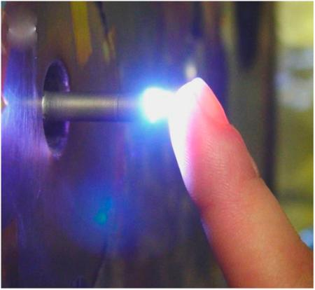

# LTPS (Low Temperature Plasma Simulator)



  This software consists of FOAM based FV method and other utilities designed and implemented for modular, multiphysics plasma fluid simulation.

The foam-extend snapshot used in this project corresponds to following
```
commit efcc2b1b7df8543c7873f89a6f50c30e047b1b11
Date:   Thu Apr 12 14:05:28 2018 +0100
``` 

## Acknowledgments
* Hat tip to anyone who's code was used
